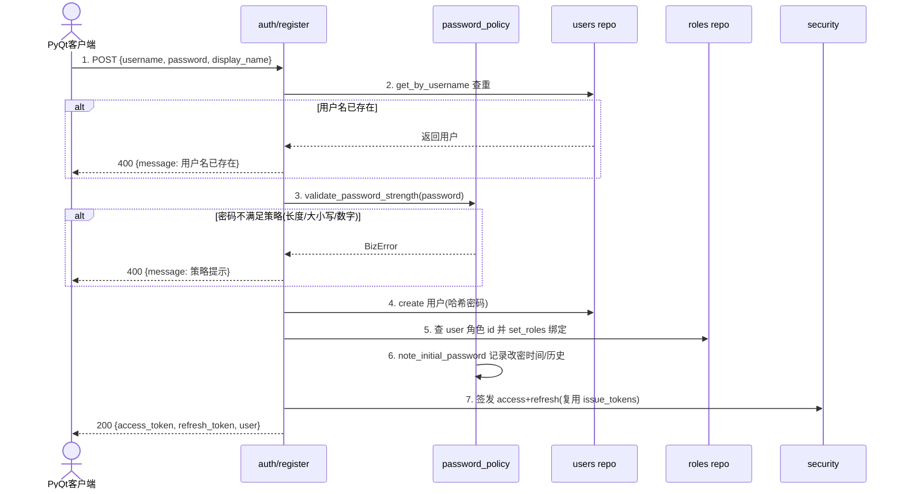
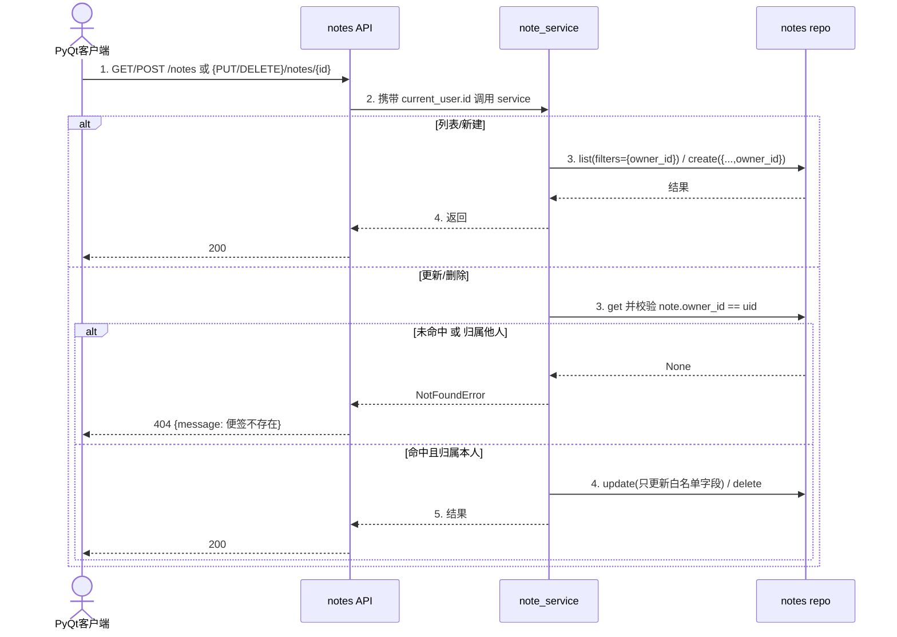

# 便签应用（sticky-notes）v0.1.0 便签模块 微型设计说明书

> **[AI读取引导]** 本文档描述单个模块的小规模改动设计，是辅助编码和代码评审的核心参考文档。AI 读取本文档可获取：改动目的与方案、修改位置与方法、接口/数据结构变更、异常处理策略、关联影响分析、关键测试用例。**本文档不包含**完整子系统架构设计（见子系统级设计文档）。

---

## 高密度摘要

> **[抗上下文衰减]** 本节是全文关键信息的前置索引。

**改动类型：** ☐ 补丁/移植型 / ☑ 功能型（小功能新增或现有功能调整）

**改动一句话描述：** 复制 `fastapi_template` 为独立项目 `sticky-notes`，新增便签（notes）业务模块与自助注册接口，并新增 PyQt5 桌面贴纸式便签客户端（多用户、每人可贴多张便签、开放注册）。

**涉及模块/文件：**
- 后端新增：`backend/db/sql/note.py`、`backend/schemas/note.py`、`backend/repositories/note.py`、`backend/services/note_service.py`、`backend/api/v1/notes.py`
- 后端修改：`backend/db/seed.py`、`backend/db/sql/__init__.py`、`backend/db/mongo/indexes.py`、`backend/repositories/__init__.py`、`backend/api/v1/router.py`、`backend/api/v1/auth.py`、`backend/schemas/auth.py`、`backend/services/auth_service.py`
- 前端新增：`desktop_client/`（PyQt5 客户端：入口、API 封装、登录/注册对话框、主界面托盘、贴纸便签窗口）
- 既有部分（认证/RBAC/动态菜单/浏览器后台/DB 双实现/定时任务）**保持不变**

**全局强约束（必须遵守）：**
- **必须**：所有章节不得为空；如不涉及须说明原因
- **必须**：§4 关联分析不得省略，即使认为"无影响"也须显式说明分析过程
- **必须**：验证点/验证案例须客观可执行（可用 ✅/❌ 判定）
- **禁止**：用本文档替代需要做概要设计的较大功能改动

---

# 1. 介绍

## 1.1 目的

将开箱即用的 `fastapi_template`（安全管控平台模板：三档角色 RBAC + JWT/Session 双认证 + SQLite/Mongo 可切换 + 动态菜单）复制改造为一款**多用户桌面便签应用**：后端沿用模板分层与权限体系，只新增「便签」业务模块和「自助注册」接口；前端完全采用 PyQt5 桌面客户端，以 Windows 便签式的贴纸形态支持每个用户张贴多张便签（自由拖动、改色、删除、位置恢复）。

本文档用于指导编码与评审，对象为开发该功能的工程师与评审者。

## 1.2 定义和缩写

| 缩写/术语 | 定义 | 备注 |
|---|---|---|
| 便签（Note） | 一张用户创建的记录，包含标题、内容、颜色、屏幕坐标 | 归某个用户所有，仅 owner 可读写 |
| 贴纸式 | 每个便签是一个独立无边框顶层窗口，可自由拖动摆放 | 与 Windows 便签一致 |
| 普通用户（user 角色） | 开放注册创建的用户，只拥有 `note:*` 权限，只能访问自己的便签 | 新增角色 |
| owner_id | 便签的归属用户 id（users.id） | 多用户隔离的依据 |
| RBAC | 基于角色的访问控制（三档：superadmin/admin/readonly + 新增 user） | 复用模板 |

## 1.3 参考和引用

1. 本项目 README.md（模板特性与分层铁律）
2. 模板新增功能模块指南 `docs/新增功能模块指南.md`（十步八件套）
3. `fastapi_template` 原项目（新项目为完整副本 + 本文档所述改动）

---

# 2. 模块方案概述

> **[本章要点]** 说清楚"改什么、为什么改、怎么改"。

## 2.1 改动背景与目标

**问题描述：** 用户需要一款（a）后端接口化、（b）PyQt 桌面前端、（c）多用户、（d）每人可贴多张便签、（e）支持自助注册的便签应用。模板已提供认证/RBAC/数据库/双实现等全部基础设施，直接在其上增量开发成本最低。

**改动目标：**

| 目标项 | 描述（量化） |
|---|---|
| 功能目标 | 支持注册、登录、便签 CRUD；每人可贴多张便签并恢复位置 |
| 多用户目标 | 便签严格按 owner 隔离：A 用户不可见/不可改 B 的便签 |
| 兼容目标 | 既有认证/RBAC/浏览器后台/既有单测全部保持通过，不破坏原模板能力 |
| 工程质量 | 严格沿用模板分层（api→services→repositories→db）与字段白名单防 mass-assignment |

## 2.2 方案设计

**方案描述：** 复制模板为 `sticky-notes` 独立项目，按模板「八件套」新增 note 模块（SQL 模型即 Mongo 兼容）；在 auth 路由新增 `POST /auth/register` 自助注册（校验用户名唯一 + 密码策略 → 绑定新角色 `user` → 返回令牌自动登录）；新增 PyQt5 桌面客户端 `desktop_client/`，使用 JWT Bearer 令牌调用接口，桌面呈现每个便签独立窗口并存库存取位置。

**方案选型（已通过需求澄清确认）：**

| 决策点 | 选定方案 | 备选 | 选择理由 |
|---|---|---|---|
| 便签形态 | 桌面贴纸式（独立窗口可拖动） | 窗口列表式 | 用户明确选择贴纸式，贴近系统便签体验 |
| PyQt 版本 | PyQt5 | PyQt6 | 用户明确选择；文档全、稳定 |
| 注册流程 | 开放注册，即注册即登录 | 管理员审批 | 用户明确选择开放注册，减少手续 |
| 浏览器后台 | 保留不动 | 删除 | 浏览器管用户/角色/菜单，PyQt 管便签，互不干扰、零成本 |
| 数据库 | SQLite（模板默认） | MongoDB | 单机应用默认即可，架构可无缝切换 |
| 认证模式 | JWT | Session | 桌面客户端用 `Authorization: Bearer` 最简洁；模板双模式无需改业务代码 |

## 2.3 方案对现有设计的影响概述

后端：新增 1 张表（notes）、1 个接口模块（notes CRUD）、1 个注册接口、seed 新增 1 个角色（user）与 4 个权限码；不动既有表结构与接口。前端：保留浏览器静态前端托管，新增独立 `desktop_client/` 目录（不参与后端托管）。整体为纯增量，既有功能需回归验证（§4.1）。

---

# 3. 模块详细设计

功能型改动 → 填写 §3.2，§3.1 不涉及（功能型改动）。

## 3.2 功能型改动设计

### 3.2.1 接口变更

**新增接口：**

| 接口名称 | 路径 | 方法 | 功能说明 | 权限 |
|---|---|---|---|---|
| 自助注册 | `/api/v1/auth/register` | POST | 校验用户名唯一+密码策略→创建普通用户（绑定 user 角色）→返回令牌对（注册即登录） | 匿名可调（豁免密码到期网关） |
| 便签列表 | `/api/v1/notes` | GET | 返回当前用户**全部**便签（repo 自定义 `list_for_owner` 取全部、不分页；顺序由客户端按 updated_at 排序） | `note:list` |
| 新建便签 | `/api/v1/notes` | POST | 创建便签，owner 固定为当前用户 | `note:create` |
| 修改便签 | `/api/v1/notes/{id}` | PUT | 仅 owner 可改；字段部分更新 | `note:update` |
| 删除便签 | `/api/v1/notes/{id}` | DELETE | 仅 owner 可删 | `note:delete` |

> ⚠️ owner 过滤在 service 层强制：`update/delete 先按 id+owner_id 命中，未命中即 404`，权限码只作为入口门槛，防止越权访问他人便签。

**变更接口：** 无（auth 路由仅新增 register 端点，既有端点不动）。

**消息接口变更：** 无。

### 3.2.2 内部流程设计

#### 3.2.2.1 自助注册流程

**流程描述：** 匿名用户提交用户名/密码/可选显示名，后端校验并建号、绑角色、签令牌，注册即登录。



**详细步骤说明：**

| 步骤 | 类型 | 处理内容 | 涉及模块/函数 | 异常处理（错误码 + 处理动作） |
|---|---|---|---|---|
| 1 | [外部] | 接收注册请求 | `api/v1/auth.py : register` | 参数非法 422（框架） |
| 2 | [内部] | 用户名查重（唯一约束兜底） | `repositories.user : get_by_username` | 重复 400 「用户名已存在」 |
| 3 | [内部] | 密码策略校验 | `services.password_policy : validate_password_strength` | 不满足 400，返回具体策略提示 |
| 4 | [内部] | 建号并写密码哈希/改密时间 | `repositories.user.create` + `password_policy.note_initial_password` | 唯一冲突 → 400（防并发重复注册） |
| 5 | [内部] | 绑定 user 角色 | `repositories.user.set_roles` | 角色缺失 → 500（种子数据缺失属环境问题） |
| 6 | [内部] | 签发令牌 | `services.auth_service.issue_tokens` | 复用现有逻辑 |

#### 3.2.2.2 便签 CRUD 归属校验流程

**流程描述：** 任何已登录用户（持 note:* 权限）操作便签，service 层按 `id + owner_id` 组合过滤，保证多用户隔离。



### 3.2.3 数据结构变更

#### 3.2.3.1 数据库 Schema 变更

```sql
-- 变更类型：新增表
-- 变更说明：便签表，owner_id 实现多用户隔离；pos_x/pos_y 保存桌面贴纸坐标
-- 所属仓库：sticky-notes（SQL 侧；Mongo 由 repositories 自动兼容）

CREATE TABLE notes (
    id          VARCHAR(32) PRIMARY KEY,          -- UUID hex
    owner_id    VARCHAR(32) NOT NULL,             -- 归属用户 users.id
    title       VARCHAR(256) DEFAULT '',          -- 便签标题（可空）
    content     TEXT DEFAULT '',                  -- 便签内容
    color       VARCHAR(16) DEFAULT '#fff9c4',    -- 贴纸颜色（十六进制）
    pos_x       INTEGER DEFAULT 0,                -- 桌面横坐标
    pos_y       INTEGER DEFAULT 0,                -- 桌面纵坐标
    created_at  DATETIME,                         -- 创建时间
    updated_at  DATETIME                          -- 更新时间
);

CREATE INDEX idx_notes_owner ON notes(owner_id)
  COMMENT '服务按 owner 列出/隔离便签的查询';
```

> MongoDB 侧：在 `backend/db/mongo/indexes.py: ensure_indexes` 追加
> `await get_collection("notes").create_index("owner_id")`，与 SQL 侧对齐。

**Seed 变更（`backend/db/seed.py`，幂等）：**
- `INIT_PERMISSIONS` 追加 4 条：`note:list/create/update/delete`（module=note）
- `INIT_ROLES` 追加：`{"name": "普通用户", "code": "user", "description": "注册用户，管理自己的便签"}`
- `ROLE_PERMISSION_CODES` 追加：`"user": ["note:list","note:create","note:update","note:delete"]`；`admin` 追加 `note:*` 四条
- 菜单：不新增（浏览器后台不管理便签；普通用户浏览器端无便签菜单属预期）

#### 3.2.3.2 配置文件变更

| 字段名 | 变更类型 | 类型 | 默认值 | 取值范围 | 含义 | 修改需重启 |
|---|---|---|---|---|---|---|
| `APP_NAME` | 修改 | string | 安全管控平台模板 → 便签应用 | - | 应用显示名（.env 与 config.AppSettings） | 否 |

其余配置（AUTH_MODE=jwt、DB_BACKEND=sqlite、密码策略、验证码）沿用模板默认，不新增配置项。

#### 3.2.3.3 内存数据结构变更（PyQt 客户端）

```python
# desktop_client/api.py 的 TokenStore：令牌与服务器地址的本地持久化
@dataclass
class ClientConfig:
    base_url: str = "http://127.0.0.1:8000"       # 服务器地址（登录框可改）
    access_token: str = ""
    refresh_token: str = ""
    username: str = ""
    # 持久化：~/.config/sticky_notes/config.json，权限 0600
```

### 3.2.4 异常处理设计

| 异常场景 | 触发条件 | 影响范围 | 处理策略 | 错误码 | 恢复方式 |
|---|---|---|---|---|---|
| 用户名重复 | 注册用户名已存在（含并发竞态） | 单次请求 | 返回可读提示；依赖 unique 约束兜底 | 400 | 换用户名重试 |
| 并发重复注册（竞态） | 同一用户名并发 POST | 单次请求 | users.create flush 抛 IntegrityError → 捕获并转为 BizError(400) | 400 | 换用户名重试 |
| 密码不满足策略 | 长度<8 / 缺大写/小写/数字 | 单次请求 | 返回具体策略提示 | 400 | 按提示重输 |
| 越权访问 | 用户 A 更新/删除 B 的便签 | 单次请求 | service 按 id+owner 命中，未中即 404（不泄露存在性） | 404 | 无 |
| 未登录/令牌失效 | 无/过期 Bearer | 单次请求 | 现有 AuthError | 401 | 重新登录 |
| 服务不可达（客户端） | 后端未启动/地址错 | 客户端单次操作 | 弹窗提示，不崩溃 | - | 校验地址后重试 |

---

### 3.2.5 PyQt5 桌面客户端设计（desktop_client/）

**模块布局：**

```
desktop_client/
├── app.py            # 入口：读本地令牌→有则进主界面，无/401→登录框
├── api.py            # requests 封装：ClientConfig(令牌存储) + register/login(captcha)/notes CRUD
├── config.py         # 服务器地址读取/保存（~/.config/sticky_notes/config.json，0600）
├── login_dialog.py   # 登录/注册对话框（含验证码图片展示与刷新）
├── desk.py           # 主界面：系统托盘 + 「新建便签」+ 便签列表/恢复位置
└── note_window.py    # 贴纸便签窗口：无边框、可拖动、改色、删除、关窗即存
```

**登录验证码处理（关键，模板默认开启）：**
- `GET /api/v1/auth/captcha` → 返回 `{captcha_id, image_base64}`，客户端用 `requests.Session`（自动保存/回传 `anon_sid` cookie）请求，base64 → QPixmap 显示；提供「换一张」按钮刷新
- 登录提交 `{username, password, captcha_id, captcha_code}`（`LoginIn` 契约）
- 注册接口不接验证码（开放注册，与模板 login 分离）

**多便签与位置恢复：**
- 主界面列出当前用户全部便签；双击或「新建」打开便签窗口
- 每个便签窗口在 `moveEvent`/关闭时防抖 PUT `pos_x/pos_y`（延迟 500ms），内容在失焦/`Ctrl+S`/关闭时保存
- 启动时按 `pos_xy` 恢复所有便签窗口位置（越界坐标修正到屏幕内）

**令牌与地址持久化：** `~/.config/sticky_notes/config.json`（0600），含 base_url/access_token/refresh_token/username；access 失效用 refresh 续期一次，失败则回登录框。

---

# 4. 关联分析

> **[必须填写]** 分析并梳理改动对已有功能的影响。

## 4.1 功能影响分析

| 影响类型 | 受影响模块/功能 | 影响描述 | 处理方式 | 是否需要回归测试 |
|---|---|---|---|---|
| seed 变更 | 角色/权限初始化 | 新增 user 角色与 note 权限；旧库不会自动重建角色 | seed 幂等，重启即增量补齐；admin 角色追加 note 权限 | 是（登录→菜单→CRUD 冒烟） |
| 路由变更 | v1 路由 | notes 独立 router 追加，密码到期网关照常挂载 | 追加 include_router 即可 | 是 |
| 既有表/接口 | 用户/角色/菜单/设备 | 本次不动既有结构与接口 | 无 | 是（现有冒烟） |
| 认证链 | 登录/验证码/锁定 | register 端点豁免密码到期网关（放 auth 路由），不影响 login | 无 | 是 |
| 浏览器后台 | 前端静态托管 | 保留不动；普通用户登录浏览器无便签菜单（预期） | 无 | 否（管理员操作不变） |
| PyQt 客户端 | 桌面端（新增） | 与浏览器后台独立，互不影响 | 独立目录 | 手工验证 |

## 4.2 DFX 影响评估

| DFX 维度 | 是否受影响 | 影响说明 | 处理方式 |
|---|---|---|---|
| 安全性 | ☑ 是 | 新增接口须鉴权；便签须多用户隔离；注册开放存在撞号/垃圾注册风险 | note 接口挂权限 + service owner 过滤；注册查重+密码策略；JWT 沿用模板 |
| 可靠性 | ☑ 是 | 新增 DB 表与一致性约束 | 幂等 seed；唯一约束；事务由 repo 层保证 |
| 性能 | ☑ 是 | 新增便签查询 | notes.owner_id 建索引 |
| 可运维性 | ☑ 是 | 新增服务/目录 | desktop_client 提供独立 `requirements.txt` + 启动脚本；后端复用模板 systemd |
| 可测试性 | ☑ 是 | 新增接口 | pytest 专项（模块隔离、注册、单测回归） |
| 兼容性 | ☑ 是 | SQLite/Mongo 双实现 | note repo 复用通用助手，双端语义一致 |
| 隐私/数据安全 | ☑ 是 | 便签内容含用户私密数据 | owner 隔离 + 仅本人可见；令牌本地 0600 存储 |

---

# 5. 关键测试用例

> **[本章要点]** 每个测试用例须对应 §3 中的具体改动，可执行，并能被后续实施计划直接转成测试代码。

## 5.1 功能测试用例

| 用例编号 | 用例名称 | 类型 | 前置条件/测试数据 | 操作步骤/输入 | 预期结果/断言 | 自动化方式 | 关联改动 |
|---|---|---|---|---|---|---|---|
| TC-001 | 注册并自动登录 | 正常 | 空库/不存在该用户名 | 1. POST /auth/register {username:"alice",password:"Abc12345"}<br>2. 检查响应 | 200；data 含 access_token/refresh_token；用户有 user 角色 | API 集成 | §3.2.1/3.2.2.1 |
| TC-002 | 注册重名拒绝 | 边界 | alice 已存在 | 再 POST 同名注册 | 400，message 含「已存在」；库内不新增 | API 集成 | §3.2.2.1 |
| TC-003 | 注册弱密码拒绝 | 边界 | 密码"abc" | POST 弱密码 | 400，message 为策略提示 | API 集成 | §3.2.2.1 |
| TC-004 | 新建+列表便签 | 正常 | 已登录 alice | 1. POST /notes 2 条<br>2. GET /notes | 2. 列表返回 2 条，owner 均为 alice | API 集成 | §3.2.2.2 |
| TC-005 | 更新/删除便签 | 正常 | alice 有便签 note_1 | PUT /notes/note_1 改内容/坐标；DELETE | 200；再查不存在 | API 集成 | §3.2.2.2 |
| TC-006 | 跨用户隔离 | 异常 | alice、bob 各有便签 | 1. GET /notes 用 bob<br>2. bob PUT/DELETE alice 的便签 | 1. bob 列表看不到 alice 的<br>2. 返回 404 | API 集成 | §3.2.2.2/§3.2.4 |

## 5.2 回归测试用例

| 用例编号 | 回归场景 | 前置条件/测试数据 | 操作步骤 | 通过标准/断言 | 自动化方式 | 关联影响项 |
|---|---|---|---|---|---|---|
| RT-001 | 既有冒烟套件 | seed 后空库 | 运行 `pytest tests/test_smoke.py` | 登录→菜单→CRUD→权限隔离全绿 | pytest | §4.1 |
| RT-002 | 有角色自带 note 权限 | seed 后 admin | admin 登录 token 调 GET /notes | 200（可读写自己便签） | API 集成 | §4.1 |

## 5.3 异常/边界测试用例

| 用例编号 | 类型 | 异常/边界场景 | 前置条件/输入 | 操作步骤 | 预期结果/断言 | 自动化方式 |
|---|---|---|---|---|---|---|
| ET-001 | 异常 | 未登录访问便签 | 无 token | GET /notes | 401 | API 集成 |
| ET-002 | 异常 | 令牌失效 | 随机 Bearer | GET /notes | 401 | API 集成 |
| ET-003 | 边界 | 便签 position 整数边界 | pos_x/pos_y 负数或 0 | POST /notes | 200，字段按字面存取 | API 集成 |

---

# 6. 变更控制

## 6.1 变更列表

| 变更章节 | 变更内容 | 变更原因 | 对旧功能/原有设计的影响 | 确认人/日期 |
|---|---|---|---|---|
| | | | *需在编码完成后补充确认* | |

---

## 附录：文档完成自检清单

> **[使用说明]** 文档提交评审前逐项检查。⭐ 项为必检项。

### 内容完整性
- [x] ⭐ 所有章节已填写，或已注明"不涉及"及原因
- [x] ⭐ §高密度摘要：改动类型已选择（功能型），路径选择正确
- [x] ⭐ §4.1 关联分析：已逐项分析影响，"无影响"项已写明分析过程
- [x] ⭐ §4.2 DFX 影响：已逐项评估，受影响项已说明处理方式
- [x] ⭐ §5 所有测试用例可执行（有前置条件、输入/步骤、预期结果、自动化方式）

### 功能型改动（如适用）
- [x] §3.2.1 接口变更：向后兼容性已明确说明（纯新增，无破坏）
- [x] §3.2.2 流程图：包含正常流程和关键异常分支（alt/else 块）
- [x] §3.2.2 步骤说明表：内部/外部调用已区分标注
- [x] §3.2.3 数据库变更：提供回滚脚本
- [x] §3.2.3 配置变更：字段含义和是否需要重启已明确
- [x] §3.2.4 新增异常处理：包含错误码和处理动作
- [ ] §6 变更控制：编码完成后已更新并补充确认人
